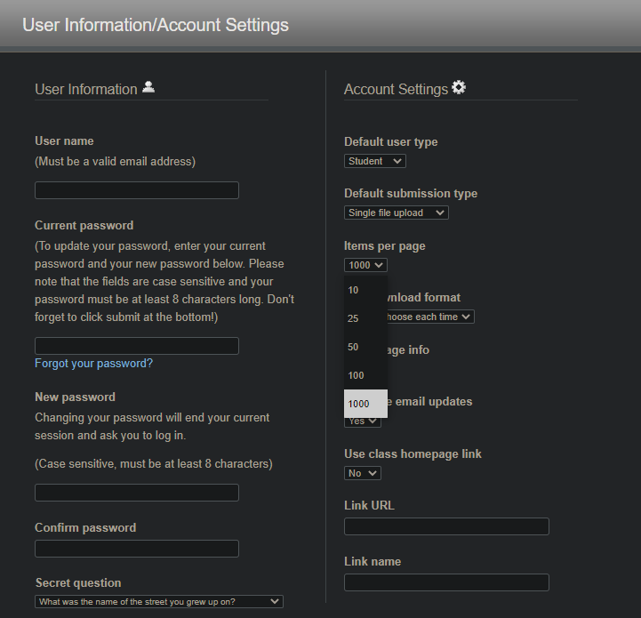

# Turnitin API
An unofficial REST API for [Turnitin.com](https://www.turnitin.com/).

Built by
[Ronak Badhe](https://github.com/r2dev2bb8/)
/
[Kento Nishi](https://github.com/KentoNishi)

## Endpoints

All endpoints are relative to [https://turnitin-api.herokuapp.com](https://turnitin-api.herokuapp.com). **Use HTTPS to protect your credentials**.


### `/login`
* Method: `POST`
* Payload:
    ```javascript 
    {
        email: "example@example.com",
        password: "password"
    }
    ```
* Response:
    ```javascript
    {
        auth: {/* authentication object */}
    }
    ```

### `/courses`
* Method: `POST`
* Payload:
    ```javascript
    {
        auth: {/* authentication object */}
    }
    ```
* Response:
    ```javascript
    [
        {
            title: "Course Name",
            url: "Course URL"
        },
        /* array of courses */
    ]

### `/assignments`
* Method: `POST`
* Payload:
    ```javascript
    {
        auth: {/* authentication object */},
        course: {/* course object */}
    }
    ```
* Response:
    ```javascript
    [
        {
            title: "Assignment Title",
            dates: {
                due: "%m/%d/%Y %H:%M:%S",
                post: "%m/%d/%Y %H:%M:%S",
                start: "%m/%d/%Y %H:%M:%S"
            },
            info: "Assignment Info",
            submission: "Submission Title",
            aid: "assignment-id",
            oid: "outbox-id"
        },
        /* array of assignments */
    ]
    ```

### `/download`
* Method: `POST`
* Payload:
    ```javascript
    {
        auth: {/*authentication object */},
        assignment: {/* assignment object */},
        pdf: false // PDF or original submission format
    }
    ```
* Response: `Raw File Bytes`


### `/submit`
* Method: `POST`
* Form Data:
    ```javascript
    {
        auth: {/* authorization object */},
        assignment: {/* assignment object */},
        title: "Submission Title",
        filename: "FileName.format",
        userfile: undefined // submission file
    }
    ```
    > The `/submit` endpoint accepts form data, not JSON. 
* Response:
    ```javascript
    {
        file_name: "File Name",
        file_size: "File Size",
        page_count: 0, // page count
        word_count: 0, // word count
        char_count: 0, // character count
        image_url_stub: "Paper Image Render URL",
        status: 1, // 0 = error, 1 = OK
        uuid: "Submission ID"
    }
    ```

# Examples

## Python 3
```python
import json
import requests

url = "https://turnitin-api.herokuapp.com"

USERNAME = "email@example.com"
PASSWORD = "password"


with requests.Session() as s:
    login_result = s.post(url + "/login", json={
        "email": USERNAME,
        "password": PASSWORD
    })
    auth = login_result.json()

    courses_result = s.post(url + "/courses", json=auth)
    courses = courses_result.json()
    for c in courses:
        if "World Lit" in c["title"]:
            world_lit = c
    print(world_lit)

    first_course_data = dict(auth, url=world_lit["url"])
    assignments_result = s.post(url + "/assignments", json=first_course_data)
    assignments = assignments_result.json()
    print(assignments[0])

    download_query = dict(**auth, assignment=assignments[0], pdf=True)
    r = s.post(url + '/download', json=download_query)
    print(f"Status code {r.status_code}")
    with open("test_download.pdf", 'wb+') as fout:
        fout.write(r.content)

    # Example case - submit to the fourth assignment 
    uf = open("Document.docx", 'rb')
    submit_query = dict(
        auth=json.dumps(auth["auth"]),
        assignment=json.dumps(assignments[3]),
        title="test submission 1",
        filename="Document.docx"
    )
    r = s.post(url + "/submit", data=submit_query, files={"userfile": uf})
    print(r.json())
```

## Additional Information
* The API may fail to collect information about your courses and assignments if there are more than 25 items. To mitigate this issue, increase the `Items per page` setting in your Turnitin `User Info` panel.

    